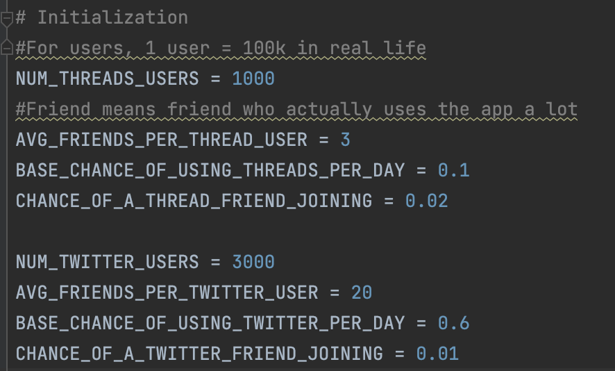

# microblogsim
a simple simulation of the two competing microblogging sites of Threads (Meta) and Twitter (X) 

first-order effects only, I don't know enough math or cs to do anything really fancy

TODO: expand sim to be more accurate (more constants) but also more useful. Some sort of greedy algo to do some rudimentary A/B testing 

Nice to have: some sort of visualization. 
